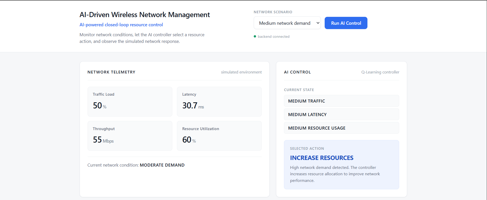

# AI Wireless Network Management

## Student Details

- **Student:** Sweety Parmar
- **Roll Number:** 5024145
- **Branch:** Information Technology
- **Year:** Third Year
- **College:** Fr. C. Rodrigues Institute of Technology
- **Academic Year:** 2026–27

---

## 1. Overview

This project is a **simulation-based AI application** that demonstrates how a wireless network's resource allocation can be managed automatically using **Q-Learning**, a reinforcement learning technique.

The core problem it demonstrates is simple: as network traffic changes, resources (like bandwidth/capacity) need to be adjusted to keep latency low and throughput high, without wasting resources when demand is low. Instead of using fixed rules, this project uses an AI agent that **learns from feedback** which action works best in a given network condition.

What the project actually implements:

- A simulated wireless network environment (traffic, latency, throughput, resource usage) written in Java — there is no real hardware, router, or Wi-Fi device involved.
- A Q-Learning agent, implemented from scratch, that is trained offline and then used live to pick one of three resource actions.
- A closed control loop: **telemetry → state → AI decision → action → new telemetry → reward → Q-table update**.
- A web dashboard that lets you pick a network demand scenario, run one control cycle, and see every stage of the loop.

This project is a **focused prototype** of the closed-loop AI/ML wireless network management concept described in the reference paper (see Section 7). It implements only the core control loop with a single, simplified action space (resource allocation) — it is **not** a full reproduction of the paper's larger, production-scale system.

---

## 2. Application Screenshot



The dashboard is the only screen in the application. It shows, top to bottom:

- **Network Telemetry** — the simulated traffic load, latency, throughput, and resource utilization for the selected scenario, along with the overall network condition (e.g. "MODERATE DEMAND").
- **AI Control** — the discretized state (traffic/latency/resource level as LOW, MEDIUM, or HIGH) that the Q-Learning controller received, the action it selected (e.g. "INCREASE RESOURCES"), and a short explanation.
- **Network Response** — a before/after comparison of latency, throughput, and resource utilization once the selected action was applied.
- **Reward / Controller Status / Feedback** — the reward calculated for that outcome and confirmation that the controller's Q-table was updated.

The user selects a network scenario (Low/Medium/High demand) from the dropdown and clicks **Run AI Control** to execute one full closed-loop cycle.

---

## 3. Tech Stack

| Technology | Purpose |
|---|---|
| Java | Backend logic — Q-Learning agent, simulated network environment, and HTTP server |
| Java HTTP Server (`com.sun.net.httpserver.HttpServer`) | Built-in JDK HTTP server that serves the dashboard and exposes the `/api/run-loop` endpoint (no external web framework is used) |
| Q-Learning | The AI technique used to learn resource-allocation decisions |
| HTML | Structure of the web dashboard |
| CSS | Styling/layout of the dashboard |
| JavaScript | Calls the backend API and renders the returned data on the dashboard |

**Q-Learning is implemented directly**, from scratch, in `QLearningAgent.java` (a manually maintained Q-table with a standard Q-learning update rule). No external machine learning library (e.g. no TensorFlow, no scikit-learn, no DL4J) is used anywhere in the project.

---

## 4. Architecture

```
Web Dashboard
      ↓
Java HTTP Server
      ↓
Q-Learning Agent
      ↓
Network Environment
      ↓
Simulated Network Response
      ↓
Reward / Feedback
      ↓
Q-Table Update
```

**Component roles:**

- **`Main.java`** — Starts the Java HTTP server, trains the Q-Learning agent offline at startup, serves the web dashboard files, and exposes the `/api/run-loop` API that runs one full closed-loop cycle per request.
- **`QLearningAgent.java`** — Holds the Q-table (27 states × 3 actions), chooses actions (ε-greedy), and applies the Q-learning update formula.
- **`NetworkEnvironment.java`** — The simulated wireless network. Generates telemetry, applies the chosen action, updates latency/resources, and calculates the reward.
- **`NetworkState.java`** — Represents the discretized state (traffic/latency/resource level, each LOW/MEDIUM/HIGH) and converts it to a Q-table index.
- **`NetworkTelemetry.java`** — Simple data holder for the raw simulated telemetry values (traffic load, latency, throughput, resource usage) shown on the dashboard.
- **`Action.java`** — Enum of the three possible resource-control actions.
- **`web/index.html`, `web/style.css`, `web/script.js`** — The dashboard UI. `script.js` only calls `/api/run-loop` and displays the JSON response; it does not make any AI decisions itself.

---

## 5. Working

1. **Network telemetry** — `NetworkEnvironment` generates simulated values for traffic load (%), latency (ms), throughput (Mbps), and resource utilization (%), based on the selected scenario and some randomness so results aren't identical every run.

2. **State representation** — The raw telemetry is discretized into a `NetworkState` made of three levels: traffic, latency, and resource usage, each bucketed into LOW (0), MEDIUM (1), or HIGH (2). This gives **3 × 3 × 3 = 27 possible states**, verified from `QLearningAgent.java` (`NUMBER_OF_STATES = 27`).

3. **Q-Learning decision** — The agent looks up the Q-values for the current state in its Q-table and, during the live demo, picks the action with the **highest learned Q-value** (`getBestAction`). During offline training it also explores randomly sometimes (ε-greedy), starting at an exploration rate of 0.2 and decaying by 0.995 each episode down to a minimum of 0.01.

4. **Resource-management action** — One of **3 actions** is applied (verified in `Action.java`): `INCREASE_RESOURCES`, `MAINTAIN_RESOURCES`, or `DECREASE_RESOURCES`. This changes the resource level up, down, or leaves it unchanged (bounded between 0 and 2).

5. **Simulated network response** — `NetworkEnvironment` recalculates latency based on the new resource level and current traffic level, then regenerates telemetry (traffic load, latency, throughput, resource usage) to reflect the "after" state.

6. **Reward calculation** — The reward combines a latency component (+6 for LOW latency, +2 for MEDIUM, −6 for HIGH) and a resource-efficiency component that depends on how well the resource level matches the traffic level (e.g. using HIGH resources under HIGH traffic is rewarded, but using HIGH resources under LOW traffic is penalized).

7. **Feedback and Q-table update** — The reward is fed into the standard Q-learning update rule:

   ```
   Q(s,a) = Q(s,a) + α [ r + γ · maxQ(s',a') − Q(s,a) ]
   ```

   with learning rate α = 0.1 and discount factor γ = 0.9 (both from `QLearningAgent.java`). This update happens both during the 5,000-episode offline training run at startup, and again live every time the dashboard's "Run AI Control" button is clicked — so the controller keeps learning during the demo too.

---

## 6. Sample Output


---

## 7. Reference Paper

**"Intelligent Wireless Network Management Through AIML-Driven Closed-Loop Control and Feedback Mechanisms"**

- **Authors:** L. Bhagyalakshmi, Sanjay Kumar Suman, Parvathy K., Gurrapu Ramya, G. Deepa, Hitha Poddar
- **Conference:** IC-EETA 2025
- **Pages:** 876–882
- **DOI:** 10.1109/IC-EETA66496.2025.11548192

**How this project relates to the paper:** The paper proposes a broad, production-scale closed-loop wireless network management system — telemetry pipelines, multiple AI/ML control models, multiple action types (power, channel, scheduling, handover), safety filters, and staged rollout. This project implements a **much smaller, simulation-based subset** of that idea: just the core telemetry → AI controller → action → network response → feedback loop, using a single AI technique (Q-Learning) and a single action space (resource allocation).

This project does **not** claim to implement the paper's full research system, its multi-tier architecture, or its other candidate ML models (e.g. deep reinforcement learning). It is a simplified, teaching-scale prototype inspired by the paper's closed-loop concept.

---

## 8. Demo Walkthrough

1. **Start the application** — Run `run.bat` (Windows). This compiles the Java backend with `javac -d out src\*.java`, then starts it with `java -cp out Main`. Starting the backend also trains the Q-Learning agent offline (5,000 episodes), which takes a few seconds.
2. **Open the web dashboard** — Go to `http://localhost:8080` in a browser (this opens automatically via `run.bat`).
3. **Select a scenario** — Choose Low, Medium, or High network demand from the dropdown at the top right.
4. **Run AI control** — Click the **Run AI Control** button. This calls `GET /api/run-loop?scenario=...` on the backend.
5. **Observe network telemetry** — Check the "Network Telemetry" card for the simulated traffic load, latency, throughput, and resource utilization.
6. **Observe the Q-Learning decision** — Check the "AI Control" card for the discretized state and the action the controller selected, with its reason.
7. **Observe the network response** — Check the "Network Response" card for the before/after comparison of latency, throughput, and resource utilization.
8. **Observe reward/feedback** — Check the reward value and controller status at the bottom, confirming the Q-table was updated.

---


